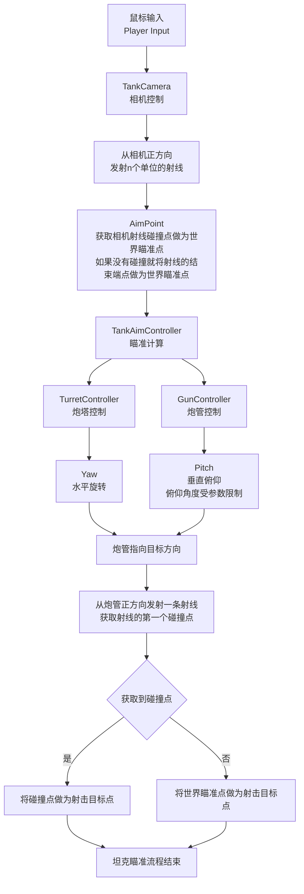

# 游戏机制

## 炮台
- 接受玩家控制
- 玩家滑动鼠标,控制炮台的开火方向

## 炮弹
- 炮台每次开火发射一枚炮弹
- 炮弹被碰撞后会发生爆炸并调用目标的受击效果

## 可攻击目标
- 固定不动的目标
- 会移动的目标
- 被击中后会扣除生命值,生命值<=0会死亡.

##  大炮瞄准流程

```mermaid
    flowchart
    A[鼠标输入<br/>Player Input] --> B

    B[TankCamera<br/>相机控制] --> 
    B1[从相机正方向<br/>发射n个单位的射线] --> C

    C[AimPoint<br/>获取相机射线碰撞点做为世界瞄准点<br/>如果没有碰撞就将射线的结束端点做为世界瞄准点] --> D

    D[TankAimController<br/>瞄准计算] --> E
    D --> F[GunController<br/>炮管控制]

    E[TurretController<br/>炮塔控制] --> G

    F --> H

    G[Yaw<br/>水平旋转] --> I

    H[Pitch<br/>垂直俯仰<br/>俯仰角度受参数限制] --> I

    I[炮管指向目标方向] --> I1
    I1[从炮管正方向发射一条射线<br/>获取射线的第一个碰撞点] --> I2
    I2{获取到碰撞点}
    I2  -->  |是|I3
    I2  -->  |否|I4
    I3[将碰撞点做为射击目标点] --> J
    I4[将世界瞄准点做为射击目标点] --> J 

    J[坦克瞄准流程结束]
```