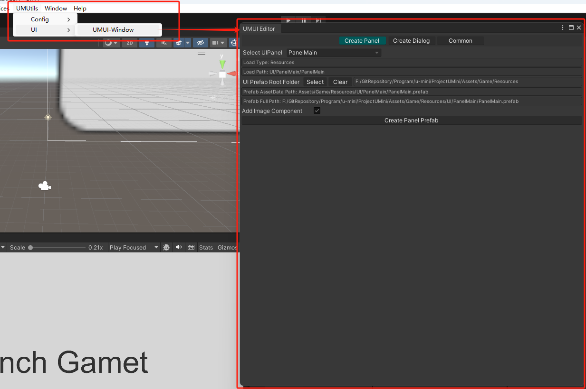

# UMUI-Window
- 

## 功能
- 用于创建Panel预制体

## 打开路径
- UMUtils => UI => UMUI-Window

## 参数解释

### Create Panel

#### Select UIPanel
- 选择要创建哪个类型的预制体.只有继承了`UMUIPanel`的类型才会在下拉框显示

#### UI Prefab Root Folder
- 选择预制体的存放根目录
- 预制体的完整目录是: 根目录+加载目录

#### Add Image Component
- 是否需要添加 Image 组件

### Create Dialog
- 未开发

### Common
-未开发