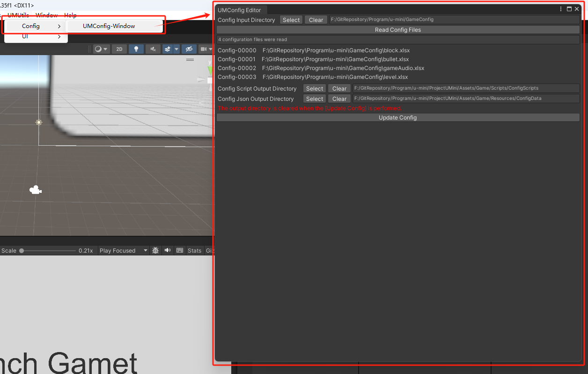

# UMConfig-Window
- 

## 功能
- 用于创建Panel预制体

## 打开路径
- UMUtils => Config => UMConfig-Window

## 参数解释

### Config Input Directory
- 配置输入目录(配置Excels存放目录)

### Config Script Output Directory
- 配置脚本输出目录, 用于存放自动生成的配置脚本
- 输出时整个目录会被清空

### Config Json Output Directory
- 配置数据输出目录, 用于存放自动生成的Json数据
- 输出时整个目录会被清空